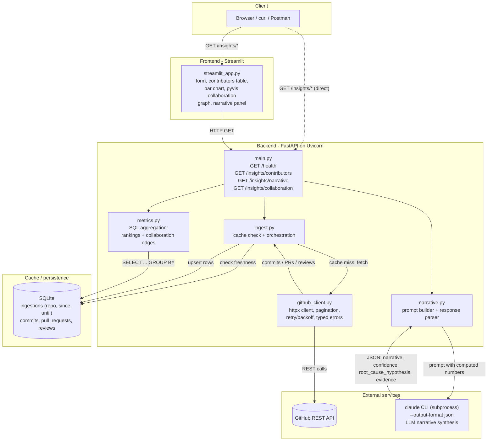

# Tempo Take-Home Loop1 — GitHub Insights Service

A small service that ingests GitHub activity for any public repo and surfaces contributor
insights, an LLM-synthesized narrative over those numbers, and a PR reviewer collaboration
graph. Built for the Loop take-home assignment — see [`PLAN.md`](PLAN.md) for the design
decisions and [`NOTES.md`](NOTES.md) for the architecture tour, trade-offs, and AI usage notes.

## Quickstart (60 seconds)

Prerequisites: Python 3.9+, a GitHub [personal access token](https://github.com/settings/tokens)
(read-only / public scope is enough), and the [`claude` CLI](https://claude.com/claude-code)
authenticated (used for the narrative endpoint — no separate API key needed).

```bash
cp .env.example .env        # then paste your GitHub token into GITHUB_TOKEN=
make setup                  # creates backend/frontend venvs, installs deps
make run-backend             # terminal 1 - serves http://localhost:8000
```

Then, in another terminal:

```bash
curl "http://localhost:8000/insights/contributors?repo=pandas-dev/pandas&since=2026-08-25&until=2026-09-04"
```

Optional UI (terminal 3):

```bash
make run-frontend            # serves http://localhost:8501
```

Full interactive API docs (curl/Postman-friendly): http://localhost:8000/docs

## Architecture



Every request re-checks SQLite before touching GitHub: a fresh `(repo, since, until)` hit skips
`github_client.py` entirely, a miss fetches and upserts. `metrics.py` never talks to GitHub —
it only aggregates whatever's already in SQLite. The narrative endpoint is the only one that
also shells out to the `claude` CLI, after computing the same numbers `/insights/contributors`
would return.

## Endpoints

All three take the same query params: `repo` (`owner/repo`), `since`, `until` (`YYYY-MM-DD`,
`until` exclusive).

| Endpoint | Returns |
|---|---|
| `GET /insights/contributors` | Contributors ranked by commits, PRs merged, lines changed |
| `GET /insights/narrative` | LLM-synthesized narrative + root-cause hypothesis + confidence + evidence over the same numbers |
| `GET /insights/collaboration` | Author ↔ reviewer edges: who reviewed whose merged PRs, and how many times |
| `GET /health` | Liveness check |

Example:

```bash
curl "http://localhost:8000/insights/narrative?repo=pandas-dev/pandas&since=2026-08-25&until=2026-09-04"
```

Error responses: `400` malformed `repo`/date range, `404` repo not found or private, `429`
GitHub rate limit exhausted, `502` narrative generation failed (CLI timeout/error), `422`
malformed/missing query params (FastAPI's standard validation).

## What "top contributors" means

Ranked by `(commits, PRs merged, lines changed)` in the given period — computed straight from
GitHub's own commit/PR data (no derived heuristics), so it's directly auditable against
`github.com/{repo}/commits` and `/pulls`. "Lines changed" is additions + deletions on **merged
PRs only** (not raw commits — GitHub's commit list endpoint doesn't expose line counts without
an expensive per-commit call, so this was a deliberate scope trade-off; see `PLAN.md`).

**One nuance worth knowing**: the `since`/`until` filter on commits uses GitHub's own filter,
which matches on *committer* date, while the numbers shown use *author* date. These usually
match, but can diverge for rebased/backported commits — a commit authored weeks earlier can
land on the branch (and pass GitHub's committer-date filter) inside your query window while its
author date falls outside it, so it won't appear in the ranking. Both dates are "correct," they
just answer slightly different questions ("when was this written" vs "when did it land").

## Testing

```bash
make test              # 55 offline tests - fixtures/mocks, no network, runs in ~0.3s
make test-integration   # 2 tests against live GitHub - needs GITHUB_TOKEN, ~15-20s
```

See `NOTES.md` for what's tested and why.

## Caching

Ingested data is persisted in SQLite (`data/insights.db`, gitignored) and keyed by
`(repo, since, until)` — the exact window queried, not just the repo. A repeat query for the
same window is served entirely from the local DB; a different window (even for the same repo)
always re-fetches from GitHub, since previously-ingested data for a different range isn't a
valid answer for a new one.
